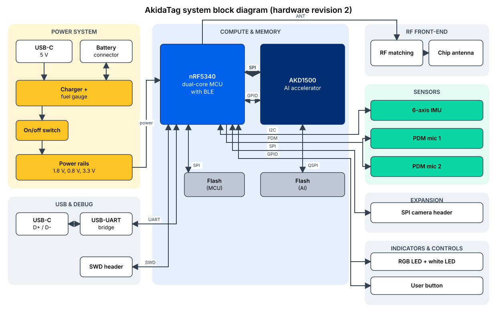
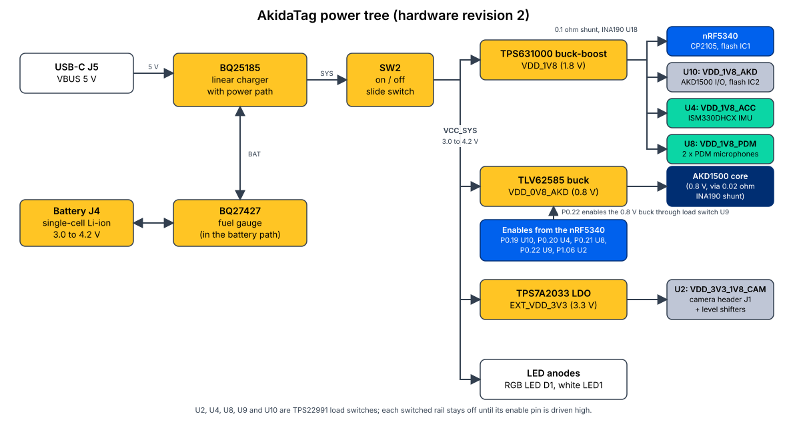

# AkidaTag block diagram

This page shows how the parts on the AkidaTag board connect to each other: the system
block diagram, the power tree, every bus between the host and its peripherals, and the
configuration the AKD1500 is strapped into. The engineering detail behind each block is in
the [datasheet](datasheet.md); the buyer-facing summary is the
[technical specifications](technical-specifications.md).

| Document status | |
|---|---|
| Hardware described | AkidaTag hardware revision 2 |
| Status | Draft for review. Every entry marked `TBD:` is awaiting confirmation; nothing here is estimated. |

---

## 1. System block diagram

The board has seven functional groups. **Compute and memory** is the Nordic nRF5340
host and the BrainChip AKD1500 AI co-processor, each with its own 16 MB SPI NOR flash.
**Power system** takes 5 V from USB-C or a single-cell Li-ion battery through the BQ25185
charger and power path, the BQ27427 fuel gauge and the on/off switch, and makes the 1.8 V,
0.8 V and 3.3 V rails. **USB and debug** is the CP2105 USB-to-UART bridge on the USB-C
data lines and the 10-pin SWD header. **RF front-end** is the antenna matching network and
the 2.4 GHz chip antenna. **Sensors** are the ISM330DHCX six-axis IMU on I2C and two PDM
MEMS microphones. **Expansion** is the camera header with a level-shifted SPI bus and a
switched 3.3 V supply. **Indicators and controls** are the RGB LED, the white LED and the
user button.

### Changes from the earlier diagram

Revision 2 is the first board shipped, but an earlier system block diagram of the
first revision has circulated, so the differences are worth stating. That board had a
20-pin expansion connector carrying GPIO, I2S, I2C, SPI, USB and UART, three buttons, 4-pin
SWD debug pads, two status LEDs, a fitted U.FL connector and a 42 mm x 30 mm outline.
Revision 2 replaces the expansion connector with the 10-pin camera header, has one button
and an on/off switch, a 10-pin SWD header, an RGB LED and a white LED, an unfitted U.FL
footprint, two current-sense amplifiers, and a 27.7 mm x 39.5 mm outline. The processors,
flashes, radio, IMU, microphones, charger and fuel gauge are the same. Sources: the
revision 2 netlist, bill of materials and board outline; the earlier system block diagram
and labelled layout drawing.

---

## 2. Power tree

Power enters from the USB-C receptacle J5 (VBUS, 5 V) or from the battery on J4. The
BQ25185 charger's power path produces the SYS node, which reaches the rest of the board
only through the on/off slide switch SW2 as VCC_SYS (3.0 to 4.2 V). VCC_SYS feeds four
things directly: the TPS631000 buck-boost that makes the 1.8 V system rail, the TLV62585
buck that makes the 0.8 V AKD1500 core rail, the TPS7A2033 LDO that makes the 3.3 V
camera rail, and the anodes of the RGB and white LEDs.

The 1.8 V rail passes through a 0.1 ohm shunt watched by INA190 U18, then powers the
nRF5340, the CP2105 bridge, flash IC1 and the pull-up resistors, and feeds three TPS22991
load switches: U10 for the AKD1500 I/O and its flash IC2, U4 for the IMU, and U8 for the
microphones. The 0.8 V buck is enabled through a fourth load switch, U9, and its output
passes through a 0.02 ohm shunt watched by INA190 U17. The 3.3 V rail powers the B side
of the camera level shifters and, through the fifth load switch U2, the camera header.
Each switch has a pull-down on its enable, so every switched rail is off until the
firmware drives the enable high.

| Enable | nRF5340 pin | Switch | Rail |
|---|---|---|---|
| VDD_1V8_AKD_EN | P0.19 | U10 | VDD_1V8_AKD |
| VDD_1V8_ACC_EN | P0.20 | U4 | VDD_1V8_ACC |
| VDD_1V8_PDM_EN | P0.21 | U8 | VDD_1V8_PDM |
| VDD_0V8_AKD_EN | P0.22 | U9, then TLV62585 EN | VDD_0V8_AKD |
| CAM_PWR_EN | P1.06 | U2 | VDD_3V3_1V8_CAM |

The battery sits behind the BQ27427 fuel gauge: the charger's BAT pin reaches the gauge's
SRX sense input, and the gauge's BAT pin reaches the connector, which is the orientation the
BQ27427 datasheet specifies. The gauge is on I2C1 at
address 0x55 and raises its GPOUT interrupt line to P0.30 when the state of charge
changes. The charger's STAT1 and STAT2 outputs go to P0.23 and P0.24 with pull-ups; a
10 kilohm NTC thermistor is on the charger's TS pin and a second on the gauge's BIN pin.

---

## 3. Buses and signals

### 3.1 Host to AKD1500: SPIM4

| Signal | nRF5340 | AKD1500 | Notes |
|---|---|---|---|
| SCK | P0.08 | SPI_S_SCK | Test point TP5; high-drive pin mode in firmware |
| MOSI | P0.09 | SPI_S_IO0 | |
| MISO | P0.10 | SPI_S_IO1 | |
| CS0 | P0.11 | SPI_S_CS_N | 10 kilohm pull-up to VDD_1V8_AKD |
| CS1 | P0.12 | SPI_S_2MCS0_N | 10 kilohm pull-up; selects the AKD1500's flash through its slave-to-master feed-through |
| SLEEP | P1.07 | SLEEP | Through 0 ohm R48; firmware `akd_lp`, asserted between inferences |
| PWR_GOOD | P1.05 | PWR_GOOD | Through 0 ohm R47; 10 kilohm pull-up to VDD_1V8_AKD; not driven by the firmware |
| GPIO0 | P1.11 | GPIO_00 | Not used by the firmware |
| GPIO1 | P1.12 | GPIO_01 | Not used by the firmware |
| GPIO2 | P0.02 | GPIO_02 | Not used by the firmware; test point TP16 |
| GPIO3 | P0.03 | GPIO_03 | Firmware `akd_async`, inference-complete interrupt |

The firmware runs this bus at 8 MHz by default and supports up to 32 MHz; the AKD1500's
second chip-select line (SPI_S_2MCS1_N) is pulled up and unused.

### 3.2 AKD1500 to its flash: SPI master

| AKD1500 | Flash IC2 | Notes |
|---|---|---|
| SPI_M_CS0_N | S# | 10 kilohm pull-up |
| SPI_M_SCK | C | Test point TP10 |
| SPI_M_IO0..IO3 | DQ0..DQ3 | Quad wiring with 4.7 kilohm pull-ups on the data lines |
| SPI_M_CS1_N | test point TP14 only | Second flash position not fitted |
| SPI_M_SCKX | test point TP15 only | |

IC2 is powered from VDD_1V8_AKD, so it is off whenever the AKD1500 I/O rail is off.

### 3.3 Host to flash IC1: SPIM3

| Signal | nRF5340 | Flash IC1 | Notes |
|---|---|---|---|
| SCK | P0.17 | C | Test point TP4 |
| MOSI | P0.13 | DQ0 | |
| MISO | P0.14 | DQ1 | |
| CS | P0.18 | S# | 10 kilohm pull-up |
| W#/DQ2 | P0.15 | DQ2 | Pulled up; single-lane operation in firmware |
| HOLD#/DQ3 | P0.16 | DQ3 | Pulled up; single-lane operation in firmware |

IC1 is on the always-on 1.8 V rail, which is what lets MCUboot read the update slot before
the application has enabled anything.

### 3.4 I2C1: IMU and fuel gauge

| Signal | nRF5340 | Devices | Notes |
|---|---|---|---|
| SCL | P1.03 | ISM330DHCX SCL, BQ27427 SCL | 2.2 kilohm pull-up to VDD_1V8_ACC |
| SDA | P1.02 | ISM330DHCX SDA, BQ27427 SDA | 2.2 kilohm pull-up to VDD_1V8_ACC |
| IMU INT1 | P0.31 | ISM330DHCX INT1 | |
| IMU INT2 | P1.00 | ISM330DHCX INT2 | Not used by the firmware |
| Gauge interrupt | P0.30 | BQ27427 GPOUT | 10 kilohm pull-up |

The IMU's SA0 pin is grounded, giving address 0x6A; the gauge answers at 0x55. The bus
pull-ups hang off the switched IMU rail, so the bus is only pulled up while VDD_1V8_ACC is
enabled.

### 3.5 PDM: microphones

| Signal | nRF5340 | Microphones | Notes |
|---|---|---|---|
| CLOCK | P1.09 | U19 CLOCK, U20 CLOCK | |
| DATA | P1.10 | U19 DATA, U20 DATA | 100 ohm series resistor on each microphone |

U19's SELECT pin is tied to its supply and U20's to ground, so the two microphones occupy
opposite channels of the PDM frame. Both are powered from VDD_1V8_PDM through a ferrite
bead each.

### 3.6 Camera header J1

| Signal | nRF5340 | Level shifter | J1 pin |
|---|---|---|---|
| CLK | P0.06 | U15 A1 to B1 | 3 |
| MOSI | P0.07 | U15 A2 to B2 | 5 |
| MISO | P0.26 | U14 A1 from B1 | 4 |
| CS | P0.25 | U14 A2 to B2 | 6 |
| Output enable | P1.15 | U14 and U15 OE (active low), 100 kilohm pull-downs | |
| Supply enable | P1.06 | Load switch U2 | 1, 2 |

The shifters' A side is VDD_1V8 and their B side is the 3.3 V rail; a 1.8 V option for
the B side and for the header supply exists through resistors that are not fitted.

### 3.7 USB-C and console UART

| Signal | Path |
|---|---|
| VBUS | J5 VBUS pins, TVS, ferrite bead L11, then the charger input and the CP2105 REGIN |
| D+, D- | J5, TVS array D2, CP2105 D+ and D- |
| CC1, CC2 | 5.1 kilohm pull-downs (sink) |
| Console TX | nRF5340 P0.29 to CP2105 RXD_SCI, test point TP11 |
| Console RX | nRF5340 P1.04 from CP2105 TXD_SCI, test point TP13 |
| CP2105 ECI port | Not connected |
| Shell | Chassis net through a ferrite bead |

### 3.8 SWD header J2

| J2 pin | Signal |
|---|---|
| 1 | VDD_1V8 |
| 2 | SWDIO (nRF5340 SWDIO, ESD diode D5, 10 kilohm pull-up) |
| 3, 5, 9 | GND |
| 4 | SWDCLK (nRF5340 SWDCLK, ESD diode D4, 10 kilohm pull-up) |
| 6 | nRESET (nRF5340 RESET, ESD diode D3) |
| 7, 8, 10 | Not connected |

### 3.9 Radio

The nRF5340 ANT pin passes through a 2.2 nH series inductor with a 0.1 uF shunt to a
fitted 0 ohm link (R8) into the chip antenna AE1. A second link (R9, not fitted) leads to
the U.FL footprint J3.

### 3.10 LEDs and controls

| Signal | nRF5340 | Circuit |
|---|---|---|
| LED_R | P1.14 | Q2 base; D1 red cathode through 500 ohm |
| LED_G | P0.27 | Q3 base; D1 green cathode through 249 ohm |
| LED_B | P1.13 | Q1 base; D1 blue cathode through 249 ohm |
| LED_W_1 | P0.28 | Q4 base; LED1 cathode through 270 ohm |
| USER_IO | P1.01 | SW1 to ground, 10 kilohm pull-up to VDD_1V8 |

D1's common anode and LED1's anode are on VCC_SYS. Q1 to Q4 are pre-biased NPN
transistors (DTC043ZUB), so each LED is on when its host pin is high.

### 3.11 Current sense

| Rail | Shunt | Amplifier | nRF5340 |
|---|---|---|---|
| VDD_1V8 | R55, 0.1 ohm | INA190A3 U18, gain 100 V/V | P0.04 (AIN0), test point TP7 |
| VDD_0V8_AKD | R28, 0.02 ohm | INA190A3 U17, gain 100 V/V | P0.05 (AIN1), test point TP6 |

Both amplifiers run from VDD_1V8 with their enable pins tied high. The A3 gain option is
100 V/V per the Texas Instruments INA190 datasheet (SBOS863D).

---

## 4. AKD1500 configuration

| Pin | Board setting | Meaning on this board |
|---|---|---|
| PCIE_HOST_SEL | Low (0 ohm to ground; pull-up not fitted) | SPI host interface selected |
| SEL_CLK | Low (0 ohm to ground; pull-up not fitted) | Crystal reference on OSC_XI and OSC_XO |
| SPI_S_MODE0, SPI_S_MODE1 | Low, low (0 ohm to ground; pull-ups not fitted) | Single-lane SPI slave |
| OP_MODE0 | Low (0 ohm to ground; pull-up not fitted) | Crystal oscillator is the internal clock source |
| OP_MODE1 | High (10 kilohm to VDD_1V8_AKD; pull-down not fitted) | Safe Mode: the chip stays on the 25 MHz reference after reset and the host switches it onto the PLL once the PLL locks; the firmware does this before raising the host SPI clock, since the host clock must stay at or below a quarter of the AKD1500's SPI slave core clock |
| TAP_SEL, TESTMODE | Low (0 ohm to ground) | Test access off |
| PCIE_PERST_N | Not connected (resistor not fitted) | PCIe unused |
| PCIe receive lanes and reference clock inputs | Tied to ground | PCIe unused |
| PCIe transmit lanes | Not connected | PCIe unused |
| PCIe PHY supplies (VP, VPH, VPTX0, VPTX1) | 0 ohm to ground | PCIe unused |
| RESREF | 200 ohm to ground | Reference resistor |
| Crystal | 25 MHz (ABM10W-25.0000MHZ-7-B1U-T3), 7 pF load capacitors, 1 megohm feedback resistor, 0 ohm series link on OSC_XI | |
| PLL supplies | VDDAPLL18 from VDD_1V8_AKD through ferrite bead L8; VDDPLL08 from VDD_0V8_AKD through ferrite bead L9; AVS_PLL to ground | |
| eFuse supplies (VDDIO_EFUSE, VQPS_EFUSE, VPD) | Not connected | Fuse programming unused |

---

## Sources

The revision 2 schematic (SI-NRF-AKD_BRD-002 V11, 2026-08-25), netlist report, bill of
materials and board outline; the earlier system block diagram and labelled layout
drawing (January 2026); the Texas Instruments INA190 datasheet (SBOS863D) and BQ27427
datasheet (SLUSEB5B); BrainChip AKD1500 documentation for the strap meanings; and the
firmware board overlay `src/boards/nrf5340_cpuapp_akidatag.overlay`,
`src/core/interface/gpio/gpio.c`, `src/core/interface/akd_spi_flash/akd_spi_flash_handler.cpp`
and `src/README.md` on `main` at firmware 1.2.0+0.

---

© 2026 BrainChip Holdings Ltd. All rights reserved.
