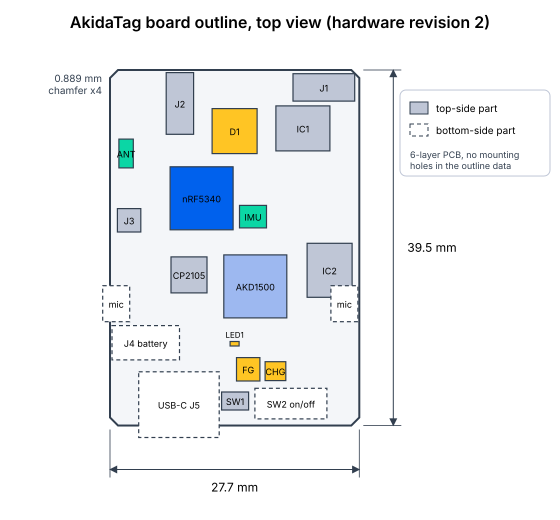

# AkidaTag datasheet

AkidaTag is a battery-powered, Bluetooth Low Energy edge-AI development device that pairs a
Nordic nRF5340 wireless system-on-chip with the BrainChip AKD1500 Akida neuromorphic
co-processor. It carries two MEMS microphones, a six-axis inertial sensor, a camera
expansion header, on-board model storage, a single-cell Li-ion charger and fuel gauge, and
a USB-C port for charging and firmware update. The companion BrainChip Connect mobile
application connects to it over Bluetooth to load models and run the demonstrations.

This page is the engineering reference for the board. The buyer-facing summary is the
[technical specifications](technical-specifications.md) page, and the circuit-level view
is the [block diagram](block-diagram.md) page.

| Document status | |
|---|---|
| Hardware described | AkidaTag hardware revision 2, design NRF-AKD1500-002 |
| Firmware referenced | The AkidaTag firmware in this repository; the current build is the [latest release](https://github.com/Brainchip-Inc/AkidaTag/releases/latest) |

---

## 1. Features

- **Host processor:** Nordic nRF5340, dual Arm Cortex-M33; 128 MHz application core with
  1 MB flash and 512 KB RAM, 64 MHz network core running the Bluetooth Low Energy
  controller.
- **AI co-processor:** BrainChip AKD1500 Akida neuromorphic processor, 22 nm FD-SOI,
  7 mm x 7 mm BGA, driven over a dedicated high-speed SPI host interface at up to 32 MHz,
  with a 25 MHz crystal and an internal PLL for a core clock of up to 400 MHz.
- **On-device learning:** the AKD1500 learns new classes on the device itself; the
  firmware exposes this over Bluetooth for keyword spotting.
- **Model storage:** 16 MB SPI NOR flash attached to the AKD1500's own SPI master port,
  written by the host through the AKD1500's slave-to-master feed-through.
- **Firmware storage:** 16 MB SPI NOR flash on the nRF5340 holding the firmware update
  slot and a LittleFS file system.
- **Audio:** two digital PDM MEMS microphones on a shared PDM bus, powered through a
  switched rail.
- **Motion:** STMicroelectronics ISM330DHCX six-axis accelerometer and gyroscope on I2C,
  with its INT1 line to the host.
- **Camera expansion:** 10-pin 1.27 mm header with a level-shifted SPI bus and a switched
  3.3 V supply, used by the firmware with an ArduCam Mega SPI camera.
- **Wireless:** Bluetooth Low Energy through an on-board 2.4 GHz chip antenna, with an
  unpopulated U.FL footprint for a test connector.
- **Power:** single-cell Li-ion battery (not supplied) with a BQ25185 linear charger and power path, a
  BQ27427 fuel gauge, a 1.8 V buck-boost converter, a 0.8 V buck converter for the
  AKD1500 core, a 3.3 V LDO for the camera header, five load switches under firmware
  control, and two INA190 current-sense amplifiers feeding the nRF5340 ADC so the
  firmware can measure the 1.8 V and 0.8 V rails.
- **USB-C:** 5 V input for charging and a CP2105 USB-to-UART bridge for the console and
  for MCUboot serial recovery. The nRF5340's own USB pins are not connected.
- **Indicators and controls:** one RGB LED, one white LED, one push button and an on/off
  slide switch.
- **Debug:** 10-pin 1.27 mm SWD header.
- **Board:** 27.7 mm x 39.5 mm, six-layer PCB.

---

## 2. Block diagram


The figure names blocks only; the part in each block is in section 3, and the
[block diagram page](block-diagram.md) lists them in one table.

The nRF5340 owns every peripheral. The AKD1500 is a slave on the nRF5340's SPIM4 bus and
in turn masters its own NOR flash; the nRF5340 reaches that flash through the AKD1500's
feed-through on the second chip select. Power enters from USB-C or the battery, passes
through the charger's power path and the slide switch, and is split into the 1.8 V system
rail, the 0.8 V AKD1500 core rail and the 3.3 V camera rail, with the AKD1500, IMU,
microphone and camera supplies each behind a load switch that the firmware turns on.

---

## 3. Functional description

### 3.1 Host processor: nRF5340

The host is a Nordic nRF5340 system-on-chip (NRF5340-QKAA-R7, aQFN94 package). Its
application core runs the AkidaTag firmware, a Zephyr RTOS application built with the
nRF Connect SDK; its network core runs the Bluetooth Low Energy controller. The firmware
raises the application core to 128 MHz, which SPIM4 needs to reach 32 MHz.

| Item | Value | Source |
|---|---|---|
| Cores | Two Arm Cortex-M33: application core up to 128 MHz, network core 64 MHz | Nordic nRF5340 product page |
| Application core memory | 1 MB flash, 512 KB RAM | Nordic nRF5340 product page; firmware partition map |
| Network core memory | 256 KB flash, 64 KB RAM | Nordic nRF5340 product page |
| Radio | Bluetooth Low Energy (Bluetooth 5.4 qualified silicon) | Nordic nRF5340 product page |
| High-frequency crystal | 32 MHz (X1) | Rev2 bill of materials |
| Low-frequency crystal | 32.768 kHz (Y1) | Rev2 bill of materials |
| Supply | VDD_1V8 on all VDD pins and VDDH, that is normal-voltage mode at 1.8 V | Rev2 netlist |
| NFC pins | Re-purposed as GPIO for AKD1500 GPIO2 and GPIO3; the firmware programs `nfct-pins-as-gpios` into UICR, a one-time setting | Board overlay, `src/README.md` |
| Application core clock in firmware | 128 MHz (`CONFIG_SYS_CPU_128MHZ`) | `src/Kconfig` |

The nRF5340's USB interface, VBUS pin and NFC antenna interface are not used on this board.

### 3.2 AI co-processor: AKD1500

The BrainChip AKD1500 is an event-based neuromorphic AI accelerator built on the Akida
neuron fabric. On AkidaTag it is used as an SPI-attached co-processor: the host loads a
compiled model into it, streams pre-processed sensor data in, and reads inference results
back. The chip can learn new classes on the device.

| Item | Value | Source |
|---|---|---|
| Part | BrainChip AKD-1500, MFCTFBGA169, 7 mm x 7 mm, 0.5 mm ball pitch | AKD1500 product brief V2.4 |
| Process | 22 nm FD-SOI | AKD1500 product brief V2.4 |
| On-chip memory | 1 MB | AKD1500 product brief V2.4 |
| Host interface used | SPI slave, single lane, from nRF5340 SPIM4 | Rev2 netlist; board overlay |
| Memory expansion | SPI master port to NOR flash IC2, quad data lines wired | Rev2 netlist |
| Clock reference | 25 MHz crystal (XTAL1, ABM10W-25.0000MHZ-7-B1U-T3) | Rev2 bill of materials |
| Core clock in firmware | 400 MHz default from the internal 800 MHz PLL; 5 to 400 MHz selectable | `src/Kconfig`, `src/README.md`; product brief gives the 5 to 400 MHz range |
| Host SPI clock in firmware | 8 MHz default, runtime selectable 1 to 32 MHz | `src/Kconfig`, `src/README.md` |
| Supplies | 0.8 V core (VDD_0V8_AKD), 1.8 V I/O (VDD_1V8_AKD); PLL supplies through ferrite beads from the same rails; PCIe PHY supplies tied to ground | Rev2 netlist |
| Strapping | PCIe host select low (SPI host); SEL_CLK low (crystal oscillator); SPI slave mode pins low; OP_MODE0 low (crystal as the clock source); OP_MODE1 high (Safe Mode, see below); TAP_SEL and TESTMODE low | Rev2 netlist; BrainChip AKD1500 documentation for the strap meanings |
| Host control lines | SLEEP from P1.07; PWR_GOOD from P1.05 (pulled up on the board); GPIO0..GPIO3 to P1.11, P1.12, P0.02, P0.03 | Rev2 netlist |
| Reset | No host-driven reset line is wired; PCIE_PERST_N is left unconnected | Rev2 netlist |

Between inferences the firmware asserts SLEEP, which gates the AKD1500 clocks while the
loaded model is retained, and releases it on demand with a reference count. The
`app stop` command additionally turns the AKD1500 PLL off for the lowest idle power.
GPIO3 (P0.03) is the completion interrupt the firmware waits on after each inference.

OP_MODE1 is strapped high, which puts the AKD1500 in Safe Mode: after reset it stays on the
25 MHz reference clock instead of switching itself onto its PLL, and the host has to make
that switch once the PLL reports lock. The firmware does this at a low host SPI clock and
only then raises the clock, because the AKD1500 requires the host clock to stay at or below
a quarter of its SPI slave core clock, which caps the host at a few megahertz while the
reference clock is in use. Source: `src/core/interface/akd_spi_flash/akd_spi_flash_handler.cpp`,
which documents the mode and performs the switch.

### 3.3 Memory

Two 128 Mbit (16 MB) SPI NOR flash devices are fitted.

| Device | Bus | Contents |
|---|---|---|
| IC1, on nRF5340 SPIM3 (chip select P0.18) | Single-lane SPI at 8 MHz; the DQ2 and DQ3 lines are pulled up and unused | MCUboot secondary (update) slot, 960 KB, then a LittleFS volume from 0xF0000 to 0x800000 |
| IC2, on the AKD1500 SPI master port | Quad SPI wired from the AKD1500; reached from the nRF5340 through the AKD1500 feed-through on SPIM4 chip select P0.12 | AKD1500 model program and the model metadata records |

The nRF5340 internal flash holds MCUboot (48 KB at 0x0), the primary application slot
(960 KB from 0xC000, including the 512-byte image header) and 8 KB of settings storage at
0xFC000. Application RAM is 448 KB, with the top 64 KB reserved for the inter-core
channel. Source: `src/pm_static.yml`.

The firmware's partition map uses the first 8 MB of IC1. Source: `src/pm_static.yml`.

Both positions are fitted with the Winbond W25Q128JWPIQ (1.8 V, 128 Mbit) listed in the
Rev2 bill of materials. A revision 2 build identifies both devices by the Winbond JEDEC ID;
see section 4 for how to build it. The default build is for revision 1 and expects the
Micron part named in the schematic symbols.

### 3.4 Audio: microphones

Two Infineon IM73D122V01XTMA1 digital PDM MEMS microphones (U19, U20) share one PDM clock
(P1.09) and one data line (P1.10), each through a 100 ohm series resistor. Their SELECT pins are tied
opposite ways, so each occupies one channel of the stereo PDM frame. They are powered from
the switched VDD_1V8_PDM rail (load switch U8, enable P0.21) through ferrite beads.

The firmware captures one channel, the left slot of the PDM frame, at 16 kHz, 16-bit, with
a PDM clock between 1.0 and 1.2 MHz, and sets the PDM gain register directly because the
Zephyr DMIC API has no gain field. The keyword spotting demonstration runs on that single
channel; the second microphone is available to firmware that requests both. Source:
`src/core/interface/audio/pdm_mic.c`, `src/include/audio/pdm_mic.h`.

The part number is from the Rev2 bill of materials. The footprint name in the design files
and the notes in this repository still carry the name of a different Infineon part, the
IM69D130.

### 3.5 Motion: inertial measurement unit

An STMicroelectronics ISM330DHCX six-axis accelerometer and gyroscope (U5) sits on I2C1
(SCL P1.03, SDA P1.02, 400 kHz) at address 0x6A, with INT1 to P0.31 and INT2 to P1.00. It
is powered from the switched VDD_1V8_ACC rail (load switch U4, enable P0.20).

The firmware defaults are 208 Hz output data rate for both sensors, plus or minus 8 g
accelerometer full scale and plus or minus 500 degrees per second gyroscope full scale, in
polling mode with FIFO batching. Source: `src/imu_app.conf`, `src/Kconfig`.

### 3.6 Camera and expansion header

J1 is a 10-pin, 1.27 mm pitch header intended for an SPI camera. Its four SPI signals
pass through two SN74AXC2T245 bidirectional level shifters (U14, U15) whose A side is
VDD_1V8 and whose B side is the 3.3 V rail, and whose output enable is driven by P1.15.
The header's supply pins are fed by load switch U2 (enable P1.06) from the 3.3 V LDO
output; a 1.8 V option exists through unpopulated resistors.

The firmware drives an ArduCam Mega camera and supports 96 x 96 and 128 x 128 RGB
frames. Source: `src/README.md`, `src/include/camera/spi_camera.h`.

See section 5.3 for the pinout and section 4 for the pins a revision 2 build uses.

### 3.7 Wireless

The nRF5340 ANT pin is matched with a 2.2 nH inductor and shunt capacitor to an Abracon
AMCA31-2R450G-S1F-T3 2.4 GHz chip antenna (AE1) through a fitted 0 ohm link (R8). A
U.FL receptacle footprint (J3) is on the board, connected through R9, which is not fitted.
Source: Rev2 netlist and bill of materials.

Bluetooth Low Energy behaviour is set by the firmware; see section 8.

Nordic specifies the nRF5340 radio for a configurable transmit power of -40 to +3 dBm and
a receiver sensitivity of -98 dBm at 1 Mbps. The firmware does not set a transmit power, so
the Bluetooth controller's default applies. Source: nRF5340 product specification, key
features; `src/prj.conf`.

### 3.8 USB-C and console

J5 is a USB Type-C receptacle. Both CC pins carry 5.1 kilohm pull-downs, so the port
presents as a sink, and VBUS feeds the charger input and the CP2105 through a ferrite bead
(L11). D+ and D- go to a Silicon Labs CP2105 dual USB-to-UART bridge (U6) behind an
SP0503 TVS array. Only the CP2105's standard port (SCI) is wired: its RXD receives the
nRF5340 console transmit (P0.29) and its TXD drives the nRF5340 receive (P1.04). The
enhanced port (ECI) is unconnected, which is why the board presents two serial ports of
which only one carries data.

The console runs at 115200 baud, 8N1, and is the Zephyr shell of the application. The
same UART is the MCUboot serial recovery channel: at every boot MCUboot listens for about
one second for an mcumgr command, so firmware can be updated over the cable with no button
and no probe. Source: `src/sysbuild/mcuboot.conf`,
[firmware update over USB](../firmware-update-over-usb.md).

### 3.9 Debug: SWD

J2 is a 10-pin, 1.27 mm pitch header carrying SWDIO, SWDCLK and reset, with ESD diodes
on all three lines. Its pinout is in section 5.4. The board's reference voltage on this
header is VDD_1V8.

Pin 6 carries nRESET and pin 10 is not connected, as the revision 2 schematic wires it. That
differs from the Arm 10-pin Cortex Debug layout, which puts SWO on pin 6 and nRESET on
pin 10, so a probe's reset line does not reach the board through a pin-to-pin cable.

### 3.10 Indicators and controls

| Item | Part | Drive | Host pin |
|---|---|---|---|
| RGB LED red | D1 (Würth 150505M173300, common anode to VCC_SYS) | NPN transistor Q2, active high | P1.14 |
| RGB LED green | D1 | Q3, active high | P0.27 |
| RGB LED blue | D1 | Q1, active high | P1.13 |
| White LED | LED1 (Inolux IN-S42ATUW, anode to VCC_SYS) | Q4, active high | P0.28 |
| Push button | SW1, tactile, to ground with a 10 kilohm pull-up to VDD_1V8 | Input, active low | P1.01 |
| On/off switch | SW2, slide, in series between the charger SYS output and VCC_SYS | Not readable by the host | none |

Source: Rev2 netlist and bill of materials. See section 4 for how the current firmware maps
its LED states onto these pins.

### 3.11 Power subsystem


| Stage | Part | Input | Output | Notes |
|---|---|---|---|---|
| Charger and power path | Texas Instruments BQ25185 (U13) | VBUS 5 V | SYS to the board, BAT to the battery | STAT1 and STAT2 to P0.23 and P0.24; R85 (560 ohm) on ISET sets a nominal 536 mA fast-charge current; R84 (13 kilohm) on ILIM/VSET selects 4.2 V battery regulation and a 1100 mA input current limit; a 10 kilohm NTC on the TS pin |
| Fuel gauge | Texas Instruments BQ27427 (U12) | In the battery path | I2C1 address 0x55, SOC interrupt (GPOUT) to P0.30 | Impedance Track gauge; the firmware writes design capacity and taper parameters at start-up |
| On/off | SW2 slide switch | SYS | VCC_SYS | Disconnects the whole board except the charger |
| 1.8 V rail | Texas Instruments TPS631000 buck-boost (U1) | VCC_SYS | VDD_1V8 | Feeds the nRF5340, the CP2105 I/O, flash IC1, the pull-ups and the four 1.8 V load switches; passes through the 0.1 ohm shunt R55 read by INA190 U18 |
| 0.8 V rail | Texas Instruments TLV62585 buck (U11) | VCC_SYS | VDD_0V8_AKD | AKD1500 core; enabled by P0.22 through load switch U9; passes through the 0.02 ohm shunt R28 read by INA190 U17 |
| 3.3 V rail | Texas Instruments TPS7A2033 LDO (U16) | VCC_SYS | EXT_VDD_3V3 | Camera level shifter B side and, through load switch U2, the camera header |
| Switched 1.8 V rails | Texas Instruments TPS22991 load switches U10, U4, U8 | VDD_1V8 | VDD_1V8_AKD, VDD_1V8_ACC, VDD_1V8_PDM | Enables P0.19, P0.20, P0.21, each with a 100 kilohm pull-down so a rail is off until the firmware turns it on |
| Current sense | Texas Instruments INA190A3 (U18, U17), gain 100 V/V | Shunts R55, R28 | P0.04 (AIN0), P0.05 (AIN1) | Read by the nRF5340 SAADC at 12 bits, gain 1/3, internal reference |

Source: Rev2 schematic, netlist and bill of materials; firmware `src/README.md` and
`src/core/interface/current_ic/current_ic.c`.

The charge current follows from the charger's formula (300 A·ohm divided by the ISET
resistor) with a stated accuracy of plus or minus 10 %. The charger precharges at 20 % of
that current while the battery is below 3.0 V, terminates at 10 % of it, and has a 6 hour
safety timer. Source: BQ25185 datasheet SLUSF65B, electrical characteristics and Table 6-1;
Rev2 bill of materials for R84 and R85.

The firmware's power-up order is: 0.8 V AKD1500 core, then the AKD1500 1.8 V rail, then
the IMU, then the microphones, then, in a revision 2 build, the camera supply, then the
camera enable. Source:
`akidatag_peripherals_power_enable()` in `src/core/interface/gpio/gpio.c`.

No battery is supplied with the board. The firmware programs the fuel gauge for an
1100 mAh, 4.2 V cell with a 3000 mV terminate voltage and a 4150 mV taper voltage, and the
source notes that these values are for a test battery, so the state of charge it reports is
only as good as the match between those parameters and the cell fitted. Revision 2
connects the battery to the gauge's BAT pin and the charger to its SRX pin, which is the
orientation the BQ27427 datasheet specifies for its integrated sense resistor. The firmware
applies the same current-sign handling on both board revisions: it inverts the sign of the
gauge's current reading to correct for a sense resistor that its code describes as
physically reversed. The resulting sign is checked on the first revision 2 board. Source:
Rev2 netlist; BQ27427 datasheet SLUSEB5B, pin functions;
`src/include/fuel_gauge/fuel_gauge.h`, `src/core/interface/fuel_gauge/fuel_gauge.c`.

---

## 4. Pin assignment

The table lists every nRF5340 GPIO as wired on hardware revision 2, and how the firmware
uses it when built for revision 2:

```sh
./scripts/run.sh -d -b --rev 2 --app demo_apps
```

The default build, without `--rev 2`, is for revision 1. Where the two revisions differ is
listed after the table.

| nRF5340 pin | Rev2 signal | Connected to | Firmware use (revision 2 build) |
|---|---|---|---|
| P0.00 / XL1 | XL1 | 32.768 kHz crystal Y1 | Low-frequency crystal |
| P0.01 / XL2 | XL2 | 32.768 kHz crystal Y1 | Low-frequency crystal |
| P0.02 / NFC1 | AKD_GPIO2 | AKD1500 GPIO_02, test point TP16 | Not used |
| P0.03 / NFC2 | AKD_GPIO3 | AKD1500 GPIO_03 | `akd_async` input, inference-complete interrupt |
| P0.04 / AIN0 | I1V8_AIN0 | INA190 U18 output (1.8 V rail current), TP7 | SAADC channel 0 |
| P0.05 / AIN1 | I0V8_AIN1 | INA190 U17 output (0.8 V rail current), TP6 | SAADC channel 1 |
| P0.06 / AIN2 | CAM_SPI_CLK | Level shifter U15 to J1 pin 3 | SPIM2 SCK, camera |
| P0.07 / AIN3 | CAM_SPI_MOSI | Level shifter U15 to J1 pin 5 | SPIM2 MOSI, camera |
| P0.08 | HSPI_SCK | AKD1500 SPI_S_SCK, TP5 | SPIM4 SCK, high drive |
| P0.09 | HSPI_MOSI | AKD1500 SPI_S_IO0 | SPIM4 MOSI |
| P0.10 | HSPI_MISO | AKD1500 SPI_S_IO1 | SPIM4 MISO |
| P0.11 | HSPI_CS0 | AKD1500 SPI_S_CS_N, 10 kilohm pull-up | SPIM4 chip select 0, AKD1500 |
| P0.12 | HSPI_CS1 | AKD1500 SPI_S_2MCS0_N, 10 kilohm pull-up | SPIM4 chip select 1, flash IC2 through the feed-through |
| P0.13 | QSPI_IO0_MOSI | Flash IC1 DQ0 | SPIM3 MOSI |
| P0.14 | QSPI_IO1_MISO | Flash IC1 DQ1 | SPIM3 MISO |
| P0.15 | QSPI_IO2 | Flash IC1 W#/DQ2, pull-up | Not used |
| P0.16 | QSPI_IO3 | Flash IC1 HOLD#/DQ3, pull-up | Not used |
| P0.17 | QSPI_CLK | Flash IC1 C, TP4 | SPIM3 SCK |
| P0.18 | QSPI_CS_0 | Flash IC1 S#, pull-up | SPIM3 chip select 0, application and MCUboot |
| P0.19 | VDD_1V8_AKD_EN | Load switch U10 ON, 100 kilohm pull-down | `akd_enb` output |
| P0.20 | VDD_1V8_ACC_EN | Load switch U4 ON, pull-down | `acc_enb` output |
| P0.21 | VDD_1V8_PDM_EN | Load switch U8 ON, pull-down | `pdm_enb` output |
| P0.22 | VDD_0V8_AKD_EN | Load switch U9 ON, then TLV62585 EN | `akd_0v_enb` output |
| P0.23 | CHGR_STS1 | BQ25185 STAT1, 10 kilohm pull-up | `chgr_sts1` input |
| P0.24 | CHGR_STS2 | BQ25185 STAT2, pull-up | `chgr_sts2` input |
| P0.25 / AIN4 | CAM_SPI_CS | Level shifter U14 to J1 pin 6, 10 kilohm pull-up | SPIM2 chip select 0, camera |
| P0.26 / AIN5 | CAM_SPI_MISO | Level shifter U14 from J1 pin 4 | SPIM2 MISO, camera |
| P0.27 / AIN6 | LED_G | Q3, RGB LED green | `led_green` output |
| P0.28 / AIN7 | LED_W_1 | Q4, white LED | `led_white`, not driven |
| P0.29 | DBG_TXD | CP2105 RXD_SCI, TP11 | UART0 TX |
| P0.30 | INT_FL_GAUG | BQ27427 GPOUT, pull-up | `fg_int` input |
| P0.31 | ACC_INT1 | ISM330DHCX INT1 | `imui` input |
| P1.00 | ACC_INT2 | ISM330DHCX INT2 | Not used |
| P1.01 | USER_IO | Push button SW1, 10 kilohm pull-up | `user_btn` input; MCUboot DFU button |
| P1.02 | ACC_FG_SDA | ISM330DHCX SDA, BQ27427 SDA, 2.2 kilohm pull-up | I2C1 SDA |
| P1.03 | ACC_FG_SCL | ISM330DHCX SCL, BQ27427 SCL, 2.2 kilohm pull-up | I2C1 SCL |
| P1.04 | DBG_RXD | CP2105 TXD_SCI, TP13 | UART0 RX |
| P1.05 | AKD_PGOOD | AKD1500 PWR_GOOD through R47, 10 kilohm pull-up to VDD_1V8_AKD, TP1 | Not used |
| P1.06 | CAM_PWR_EN | Load switch U2 ON (camera 3.3 V), 100 kilohm pull-down | `cam_pwr_enb` output, camera supply |
| P1.07 | AKD_LP | AKD1500 SLEEP through R48 | `akd_lp` output, sleep control |
| P1.08 | not connected | | Not used on this board |
| P1.09 | PDM_PCLK | Microphones U19 and U20 CLOCK | PDM clock |
| P1.10 | PDM_PDAT | Microphones U19 and U20 DATA, 100 ohm each | PDM data |
| P1.11 | AKD_GPIO0 | AKD1500 GPIO_00 | Not used |
| P1.12 | AKD_GPIO1 | AKD1500 GPIO_01 | Not used |
| P1.13 | LED_B | Q1, RGB LED blue | `led_blue`, not driven |
| P1.14 | LED_R | Q2, RGB LED red | `led_red` output; MCUboot DFU LED |
| P1.15 | CAM_SPI_EN | Level shifters U14 and U15 output enable, pull-down | `cam_enb` output, active low |

Dedicated pins: SWDIO and SWDCLK to J2; RESET to J2 pin 6; ANT to the antenna matching
network; D+, D- and VBUS not connected. Source: Rev2 netlist joined with the nRF5340 ball
map; firmware board definition `src/boards/brainchip/akidatag/` and the MCUboot overlays in
`src/sysbuild/mcuboot/boards/`.

**Differences between revision 2 and the default build.** The default build is for
revision 1. Compared with a revision 2 build, it puts the camera on the flash bus (P0.17,
P0.13 and P0.14), does not drive the camera supply enable on P1.06, drives P1.15 active
high, reads the push button on P0.26, drives the red LED on P0.28 and the green LED on P0.27
only, defines an `akdreset` node on P1.13, expects Micron flash parts (section 3.3) and
defaults to the 25 V/V INA190 (section 6.2).

---

## 5. Connectors

### 5.1 J5, USB Type-C receptacle

Würth Elektronik 632722200211, 24-pin. VBUS, D+, D-, CC1, CC2, GND and the shell are used.
The two CC pins have 5.1 kilohm pull-downs (sink). The shell is tied to a separate chassis
net through a ferrite bead. Source: Rev2 netlist and bill of materials.

### 5.2 J4, battery connector

JST XH series, 2-pin, 2.5 mm pitch (B2B-XH-A). Pin 1 is VCC_BAT (battery positive, through
the BQ27427 sense path to the charger), pin 2 is GND. Source: Rev2 netlist and bill of
materials.

No battery is supplied with the board. Fit a single-cell rechargeable Li-ion or Li-Po cell
with a JST XH 2-pin plug, positive on pin 1. The charger regulates the cell to 4.2 V and the
board is designed for 3.0 to 4.2 V on VCC_SYS (section 6.1).

### 5.3 J1, camera header

10-pin, 2 x 5, 1.27 mm pitch (CNC Tech 3221-10-0100-00). Signals are on the 3.3 V side of
the level shifters. Source: Rev2 netlist.

| Pin | Signal | Pin | Signal |
|---|---|---|---|
| 1 | VDD_3V3_1V8_CAM (switched supply) | 2 | VDD_3V3_1V8_CAM |
| 3 | SPI CLK | 4 | SPI MISO |
| 5 | SPI MOSI | 6 | SPI CS |
| 7 | not connected | 8 | not connected |
| 9 | GND | 10 | GND |

### 5.4 J2, SWD header

10-pin, 2 x 5, 1.27 mm pitch. Source: Rev2 netlist.

| Pin | Signal | Pin | Signal |
|---|---|---|---|
| 1 | VDD_1V8 (target reference) | 2 | SWDIO |
| 3 | GND | 4 | SWDCLK |
| 5 | GND | 6 | nRESET |
| 7 | not connected | 8 | not connected |
| 9 | GND | 10 | not connected |

### 5.5 J3, U.FL

Hirose U.FL-R-SMT-1(80) footprint on the antenna feed, connected through R9. R9 is not
fitted, so the connector is not part of the default build. Source: Rev2 netlist and bill
of materials.

### 5.6 Test points

TP1 through TP20 are 1 mm surface-mount test points. Those on host signals: TP1 AKD1500
PWR_GOOD, TP4 flash IC1 clock, TP5 AKD1500 host SPI clock, TP6 and TP7 the two INA190
outputs, TP11 and TP13 the console TX and RX, TP16 AKD1500 GPIO2. Rail test points: TP3
VDD_1V8, TP8 VDD_1V8_AKD, TP9 VDD_1V8_ACC, TP12 VDD_1V8_PDM, TP17 VDD_0V8_AKD, TP2
camera supply, TP18 VCC_BAT. TP10, TP14 and TP15 are on the AKD1500 SPI master port.
Source: Rev2 netlist.

---

## 6. Electrical characteristics

The values below are the settings the revision 2 design makes. Measured characteristics
will be added in a later revision of this document.

### 6.1 Recommended operating conditions

| Parameter | Min | Typ | Max | Unit | Source |
|---|---|---|---|---|---|
| USB input voltage | | 5 | | V | Rev2 schematic (VBUS 5 V) |
| Battery voltage (VCC_SYS) | 3.0 | | 4.2 | V | Rev2 schematic power block diagram |
| VDD_1V8 system rail | | 1.8 | | V | Rev2 schematic |
| VDD_0V8_AKD core rail | | 0.8 | | V | Rev2 schematic |
| EXT_VDD_3V3 camera rail | | 3.3 | | V | Rev2 schematic |
| Camera header supply | | 3.3 (1.8 option not fitted) | | V | Rev2 netlist |

### 6.2 Current consumption

Power consumption figures, per operating state and for the charge current drawn from USB,
will be added in a later revision of this document. The charger's 536 mA nominal
fast-charge setting is in section 3.11.

The firmware measures the 1.8 V and 0.8 V rails itself through the INA190 amplifiers
(`power read`, `power measure`): the shunts are 0.1 ohm on the 1.8 V rail and 0.02 ohm on
the 0.8 V rail, and revision 2 fits the 100 V/V amplifier, which a revision 2 build
selects by default. The default build selects revision 1's 25 V/V A1 part, so on that build
run `power variant a3` first. The total draw, which
also covers the charger, the LEDs and the 3.3 V rail, needs a meter in series with the
battery or the USB input. Source: Rev2 bill of materials, `src/README.md`.

What the on-board measurement can resolve follows from the INA190 datasheet. The A3 device
has a gain error of plus or minus 0.3 % and a zero-current output offset of up to 3 mV at a
1.8 V supply, which corresponds to 0.3 mA on the 1.8 V rail and 1.5 mA on the 0.8 V rail.
With the firmware's ADC setting of gain 1/3 against the internal 0.6 V reference, full scale
is 1.8 V at the amplifier output, or 180 mA on the 1.8 V rail and 900 mA on the 0.8 V rail,
less the amplifier's 20 mV swing limit below its supply. Source: INA190 datasheet SBOS863D;
`src/core/interface/current_ic/current_ic.c`.

---

## 7. Power modes

The firmware has no single "power mode" register; the states below are what the sources
describe.

| State | What is on | Source |
|---|---|---|
| Off | SW2 open: nothing after the charger is powered. The charger still charges the battery from USB. | Rev2 schematic |
| Idle, advertising | nRF5340 running the application with Zephyr device power management; AKD1500 in SLEEP (clocks gated, model retained); microphone, IMU and camera rails as left by the application | `src/prj.conf`, `gpio.c` |
| Application stopped (`app stop`) | As idle, and the AKD1500 PLL turned off | `src/README.md` |
| Inference | AKD1500 woken through SLEEP for each inference, host SPI at the configured clock, microphone capture running | `src/README.md`, `gpio.c` |
| Serial recovery | MCUboot only, listening on the console UART | `src/sysbuild/mcuboot.conf` |

Battery life in each state depends on the cell fitted; no battery is supplied with the
board.

---

## 8. Firmware interfaces

| Interface | Detail | Source |
|---|---|---|
| Bluetooth device name | `AkidaTag` (`AkidaTag-DK` on the development-kit build) | `src/prj.conf`, `src/boards/dk.conf` |
| Bluetooth role and security | Peripheral; LE Secure Connections only, MITM protection required, bonding with up to 3 bonds, 128-bit keys, resolvable private address rotated every 900 s | `src/prj.conf` |
| Advertising | Flags, complete device name, manufacturer-specific data; the device serial is never advertised | `ble_initialization.c` |
| Model transfer service | `f000aa00-0451-4000-b000-000000000000`, one flash sector per stage with an absolute offset in every write | [BLE model transfer](../ble-model-transfer.md) |
| Edge learning service | `f000bb11-0111-9000-c000-000000000000` (command `f000bb10`, acknowledgement `f000bb12`) | `edge_learning.c` |
| Command and streaming channel | Nordic UART Service frames, including battery state of charge and charger status | `src/README.md`, `battery_service.c` |
| Firmware update over Bluetooth | MCUmgr SMP over Bluetooth with the image, OS and statistics groups; MCUboot with RSA-3072 signatures, two updateable images (application and network core) | `src/prj.conf`, `src/sysbuild/mcuboot.conf` |
| Firmware update over USB-C | MCUboot serial recovery on the CP2105 UART, entered without a button | [firmware update over USB](../firmware-update-over-usb.md) |
| Console | Zephyr shell on UART0 at 115200 8N1 | `src/prj.conf`, board overlay |
| Watchdog | 8 s application watchdog | `src/prj.conf` |
| Firmware version | Readable over Bluetooth with `smpmgr image state-read`; the current build is the [latest release](https://github.com/Brainchip-Inc/AkidaTag/releases/latest) | `VERSION`, `AGENTS.md` |

---

## 9. Mechanical



In the drawing: the camera header is J1, the SWD header J2, the U.FL footprint J3, the
battery connector J4, the USB-C receptacle J5, the button SW1, the on/off switch SW2, the
two flashes IC1 (top right) and IC2 (right), and the microphones U19 and U20.

| Item | Value | Source |
|---|---|---|
| Board size | 27.7 mm x 39.5 mm | Rev2 board outline (DXF) |
| Corners | 0.889 mm chamfer on all four corners | Rev2 board outline (DXF) |
| Layer count | 6 | Rev2 fabrication artwork layer set |
| Mounting holes | None | Rev2 board outline (DXF) |
| USB-C position | Bottom side, centred near one short edge, receptacle projecting beyond the edge | Rev2 placement data |
| Microphones | Bottom side, one in each corner beside the USB-C edge | Rev2 placement data |
| Board thickness | 1.00 mm, plus or minus 10 % | Rev2 fabrication notes |
| Enclosure | The board ships in its enclosure | BrainChip product decision |

---

## 10. Product information

| Item | Value |
|---|---|
| Product name | AkidaTag |
| What is in the box | The AkidaTag board in its enclosure. No battery, USB-C cable or camera is included |
| Companion app | BrainChip Connect for Android 13 or later, in [pre-registration on Google Play](https://play.google.com/store/apps/details?id=com.brainchip.connect), and coming soon to the iOS App Store |
| Firmware and models | The [latest firmware release](https://github.com/Brainchip-Inc/AkidaTag/releases/latest) of this repository; every release attaches the model packages `akidatag-kws-model.zip` and `akidatag-kws-edge-learning-model.zip` |
| Licence | Apache License 2.0, in `LICENSE` at the root of this repository |
| Documentation | [AkidaTag documentation](https://brainchip-inc.github.io/AkidaTag/), [BrainChip Connect documentation](https://brainchip-inc.github.io/BrainChip-Connect/), [AkidaTag on the BrainChip Developer Hub](https://developer.brainchip.com/akida-tag/) and [Developer Hub sign-up](https://developer.brainchip.com/signup/) |
| Support | Help on the [BrainChip Discord](https://discord.com/invite/9bmd9g52vn); bugs as [GitHub issues](https://github.com/Brainchip-Inc/AkidaTag/issues); security problems reported privately through the repository's Security tab ("Report a vulnerability") |

---

## 11. Revision history

### Hardware

| Revision | Design | Changes |
|---|---|---|
| 2 | NRF-AKD1500-002 (V-002), schematic V11, changes dated 2026-07-07, released 2026-08-25 | Test pads added on the ADC inputs; INA190 changed to the gain-100 variant with matching shunts; camera signals brought to a header; LDO added for the camera supply; new level-shifter part for the camera signals; SWD connector added; one RGB LED added; on/off switch added; one user button added |

Revision 1 (V-001, dated 2025-12-24) was not released outside BrainChip; revision 2 is the
first board shipped. Source: the revision summary on the Rev2 schematic cover sheet.

### Document

| Date | Change |
|---|---|
| 2026-09-25 | First edition, from the revision 2 design files and the firmware on `main` |

---

## 12. Sources

- Revision 2 design files: schematic SI-NRF-AKD_BRD-002 V11 (2026-08-25), bill of
  materials NRF-AKD1500-002 V11, netlist report (2026-08-24), placement file, board
  outline DXF and fabrication artwork set.
- Firmware on `main` of this repository: `src/boards/brainchip/akidatag/`,
  `src/sysbuild/mcuboot/boards/`, `src/sysbuild/mcuboot.conf`, `src/prj.conf`,
  `src/Kconfig`, `src/pm_static.yml`, `src/apps/demo_apps/custom_app.conf`,
  `src/imu_app.conf`, `src/README.md`, `src/core/interface/gpio/gpio.c`,
  `src/core/interface/audio/pdm_mic.c`, `src/core/interface/ble_services/`,
  `src/include/fuel_gauge/fuel_gauge.h`, `docs/ble-model-transfer.md`,
  `docs/firmware-update-over-usb.md`, `AGENTS.md`.
- [AKD1500 Product Brief V2.4](https://brainchip.com/wp-content/uploads/2025/10/AKD1500-Product-Brief-V2.4-Oct.25.pdf).
- [Nordic Semiconductor nRF5340 product page](https://www.nordicsemi.com/Products/nRF5340)
  and [product specification key features](https://docs.nordicsemi.com/bundle/ps_nrf5340/page/keyfeatures_html5.html).
- Texas Instruments BQ25185 datasheet, SLUSF65B: charge-current formula, ILIM/VSET table,
  charging thresholds and timers.
- Texas Instruments INA190 datasheet, SBOS863D: gain options, gain error, zero-current
  output offset and output swing.
- BrainChip board test records: post-fabrication PCB test report (version 1.0, 2026-03-13),
  PCB testing checklist and procedures (version 1.0, 2026-02-18) and Spark board SWD
  connection guide (version 1.1, 2026-04-10).
- BrainChip AKD1500 documentation for the strap meanings and the Safe Mode clock behaviour.
- Texas Instruments BQ27427 datasheet, SLUSEB5B: pin functions.
- BrainChip product decisions of September 2026: the enclosure ships with the board, the box
  contents, and the companion app platforms.
- [BrainChip Connect on Google Play](https://play.google.com/store/apps/details?id=com.brainchip.connect)
  for the Android version.

---

© 2026 BrainChip Holdings Ltd. All rights reserved.
