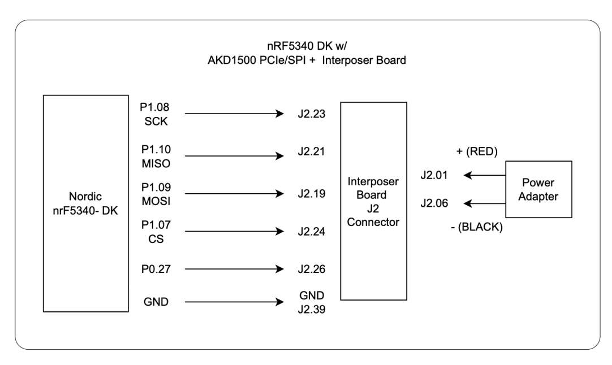
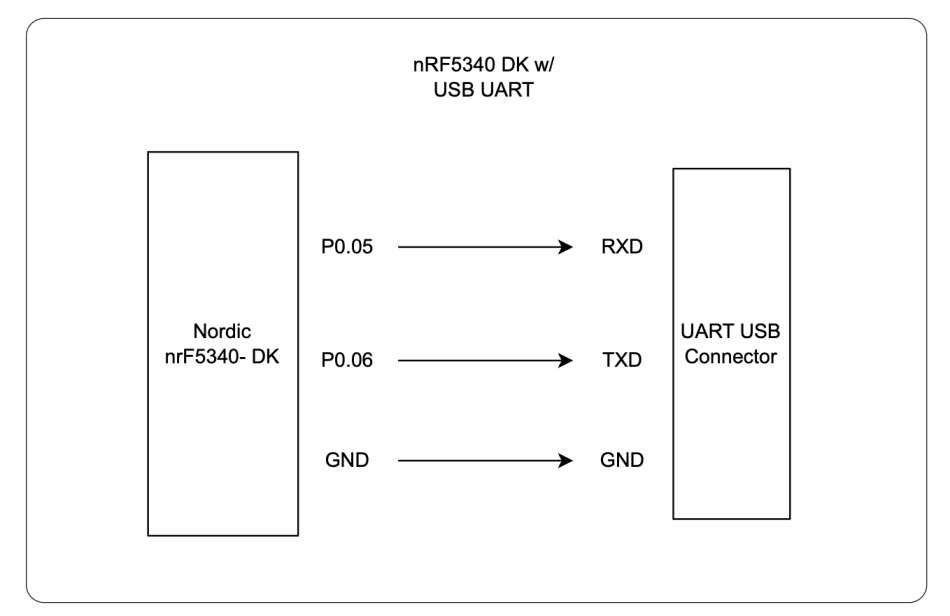

# Setup For nRF5340 DK And AKD1500 PCIe (SPI mode) + Interposer Board

### Step 1: Pin Connections with nRF5340 DK, AKD1500 & UART

Follow the pin connections as shown below:






---

### Step 2: Install Dependencies

Current setup provide dockerfile to create a docker image that will have all the required dependices.

*Note: If you'd like to install depenencies locally then follow Appendix I: Install Dependency On System.*

**Build Docker Image**

Run the following script from Project Root To Build The Docker Image.

```
# get help and usage for the script
./scripts/build_docker_image.sh -h

# build docker image for ncs v3.1.1
./scripts/build_docker_image.sh --ncs v3.1.1 --python 3.12
```

The build will take some time as it downloads ncs sdk.

Based on the scripts you ran, following images should be build and seen. See below table for reference:

`docker images`

| IMAGE                      | ID           | DISK USAGE |
|----------------------------|--------------|------------|
| akidatag-ncs:v3.1.1-py3.12 | 7d2f06ee0930 | 17.6GB     |

---

### Step 3: Build, Flash And Test Connections

*Note: Following scripts are running through docker. If installed dependency locally then simply remove `-d` from below runs.*

**1. Build And Flash demo_apps**

`demo_apps` is the application this project builds and flashes. `--dk` selects the
nRF5340 DK overlay, which is the board this document sets up.

Every build signs its images with the development key committed at `.env/development_key.pem`, so
there is nothing to set up. That key is public on purpose; see
[Application Security](../src/README.md#application-security) for what it does and does not
protect, and for how to use your own key instead.

```
# build
./scripts/run.sh -d -b --dk --app demo_apps

# flash
./scripts/run.sh -d -f --app demo_apps
```

**To see output on the terminal through UART**

```
# replace /dev/ttyUSB0 with endpoint at your system
minicom -D /dev/ttyUSB0

# install minicom if not there
sudo apt-get install minicom
```

---

**2. Test The Link To The AKD1500**

The CLI hardware test drives the firmware shell over UART and confirms the AKD1500
device ID, its SRAM and the external SPI flash, which is the communication this
setup has to get right. Testcases 1 to 7 in [README.md](../README.md#implemented-test-cases)
say what each one checks.

```
./scripts/run.sh -d -t
```

A passing run ends with `ALL TESTCASES PASSED`.

---

**3. Send A Model Over BLE And Infer**

Fetch and convert the kws model, then send it to the Akida external flash over BLE.
[src/README.md](../src/README.md) covers the model workflow and its config
files in full.

```
# fetch, convert, generate info.yaml and the model bundle .zip
./scripts/run.sh -d \
    --fetch_model .env/demo_apps/kws.yaml \
    --generate_info .env/demo_apps/kws.yaml

# send the model over BLE from the host
./scripts/run.sh --send_ble \
    --info models/kws/kws_program_info.bin \
    --bin  models/kws/kws_program_data.bin \
    --yaml models/kws/info.yaml
```

Once the transfer completes, run the inference test to confirm the model loads from
external flash and infers (Testcase 8).

```
./scripts/run.sh -d -t --infer-test
```

You can also type `infer kws` yourself on the minicom session to infer again.

---

**4. BLE FOTA**

To check that a firmware update over BLE also works, make a change to the app and
rebuild it, then find `dfu_application.zip` in the build directory
(`build_docker/demo_apps/` for a Docker build). Upload it to the board with the
nRF Connect Mobile App; the FOTA section of
[src/README.md](../src/README.md) walks through the app.

To update a board over its USB-C cable instead, with no phone and no debug probe, see
[firmware-update-over-usb.md](./firmware-update-over-usb.md).

*Tip: A simple change that I make is adding a print statement in main.cpp*

---

### Appendix I: Install Dependency On System.

**Prerequisites**

- `sudo` access
- Working on Ubuntu 22 LTS (as of 11/25/2025)
- Min version for main dependencies

  | **Tool**     | **Min. Version** |
  |------------- |--------------|
  | **cmake**    | 3.20.5       |
  | **Python**   | 3.10         |
  | **Devicetree compiler** | 1.4.6 |

  Install main dependencies with the following commands

  ```
  sudo apt install --no-install-recommends git wget make file \
  ccache dfu-util device-tree-compiler \
  xz-utils gcc gcc-multilib g++-multilib \
  libsdl2-dev libmagic1 \
  ninja-build
  ```

  Verify the version of the main dependencies

  ```
  cmake --version
  dtc --version
  ```

  If `cmake` version is not higher than min version mentioned, then follow installation of a proper version through this [link](https://docs.zephyrproject.org/latest/develop/getting_started/installation_linux.html#installation-linux).

  > A higher version of cmake can also be added using the [kitware third-party apt repository](https://apt.kitware.com/) using the script `scripts/kitware-archive.sh`

  Verify other versions:

  ```
  # currently running ninja 1.10.1
  ninja --version
  ```

- J-Link

  If it is not installed, then download from [J-Link Software and Documentation Pack](https://www.segger.com/downloads/jlink/).

  Current version installed in `v8.88`.

  After download, install using the following command:

  ```
  wget https://www.segger.com/downloads/jlink/JLink_Linux_V888_x86_64.deb
  sudo apt install ./JLink_Linux_V888_x86_64.deb
  ```

  After connecting board through USB, run `JLinkExe` and check if board is detected. The following output should be seen:

  ```
  SEGGER J-Link Commander V8.88 (Compiled Nov 19 2025 13:07:00)
  DLL version V8.88, compiled Nov 19 2025 13:05:57

  Connecting to J-Link via USB...Updating firmware:  J-Link OB-nRF5340-NordicSemi compiled Jul  8 2025 10:15:34
  Replacing firmware: J-Link OB-nRF5340-NordicSemi compiled May 18 2021 BTL
  Waiting for new firmware to boot
  New firmware booted successfully
  O.K.
  Firmware: J-Link OB-nRF5340-NordicSemi compiled Jul  8 2025 10:15:34
  Hardware version: V1.00
  J-Link uptime (since boot): 0d 00h 00m 00s
  S/N: 1050082195
  License(s): RDI, FlashBP, FlashDL, JFlash, GDB
  USB speed mode: Full speed (12 MBit/s)
  VTref=3.300V


  Type "connect" to establish a target connection, '?' for help
  ```

  > This confirms that the nRF5340 DK board is connected.


**Download And Setup nRF Util**

- Download the latest [nrfutil file](https://files.nordicsemi.com/artifactory/swtools/external/nrfutil/executables/x86_64-unknown-linux-gnu/nrfutil).

Run script from project root to install the above file

`./scripts/install_nrfutil.sh`

Add nrfutil to path - environment variable for further steps 

`source ./scripts/env.sh`


**Install nrfutil sdk-manager and device**

Install sdk-manager and device with nrfutil

 ```
# install the nrfutil sdk-manager
nrfutil install sdk-manager

# install device
nrfutil install device
```

`.nrfutil` folder will be created in your `$HOME` directory

Next, install the latest nRF Connect SDK version. v3.1.1 at the time
```
# search list of available installations
nrfutil sdk-manager search

# install the version v3.1.1
nrfutil sdk-manager install v3.1.1 
```

`ncs` folder will be created in your `$HOME` directory

---

### Prototype Board

<u>Full Setup</u>


<u>UART Connection For Ubuntu</u>


---

# References:

- [nRF Connect SDK](https://docs.nordicsemi.com/bundle/ncs-latest/page/nrf/installation/install_ncs.html)

- [Reference ZephyProject User Guide For Installation](https://docs.zephyrproject.org/latest/develop/getting_started/index.html)

- [nRF5340DK On Zephyr](https://docs.zephyrproject.org/latest/boards/nordic/nrf5340dk/doc/index.html)