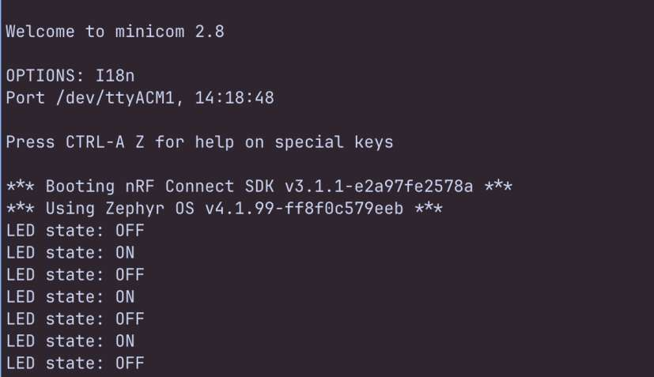
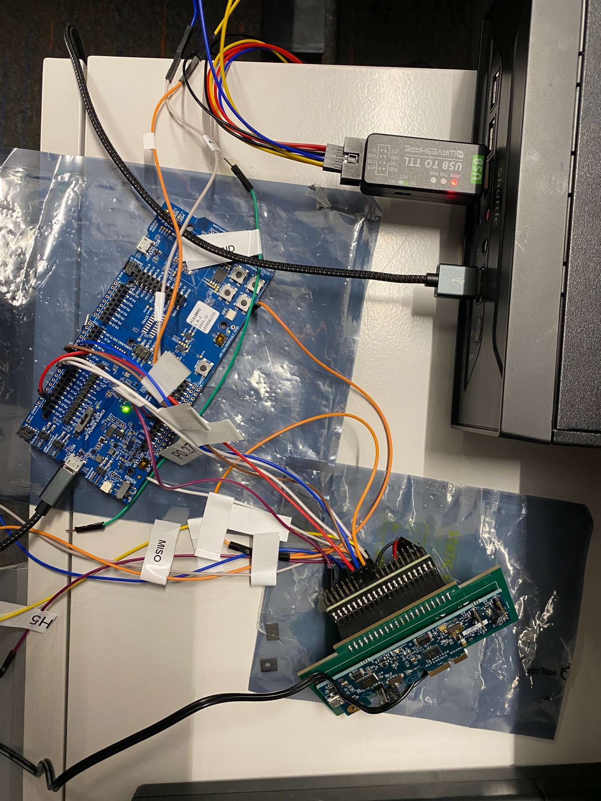
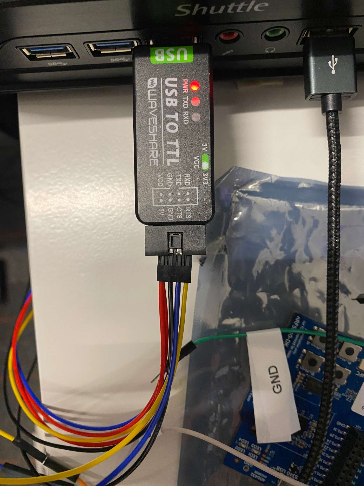

# Setup For nRF5340 DK And AKD1500 PCIe (SPI mode) + Interposer Board

### Step 1: Pin Connections with nRF5340 DK, AKD1500 & UART

Follow the pin connections as shown below:


---

### Step 2: Install Dependencies

Current setup provide dockerfile to create a docker image that will have all the required dependices.

*Note: If you'd like to install depenencies locally then follow Appendix I: Install Dependency On System.*

**Build Docker Image**

Run the following script from Project Root To Build The Docker Image.

```
# get help and usage for the script
./scripts/build_docker_image.sh -h

# build docker image for ncs v3.1.1
./scripts/build_docker_image.sh --ncs v3.1.1 --python 3.12
```

The build will take some time as it downloads ncs sdk.

Based on the scripts you ran, following images should be build and seen. See below table for reference:

`docker images`

| IMAGE                      | ID           | DISK USAGE |
|----------------------------|--------------|------------|
| akidatag-ncs:v3.1.1-py3.12 | 7d2f06ee0930 | 17.6GB     |

---

### Step 3: Test Connections

*Note: Following scripts are running through docker. If installed dependency locally then simply remove `-d` from below runs. 

**1. Blinky Sample**

This app will confirm if nRF5340 DK board is functioning. 

```
# build
./scripts/run.sh -d -b --app blinky

# flash
./scripts/run.sh -d -f --app blinky
```

Upon running this, the board should show flashing led light.

**To see output on the terminal through UART**

```
# replace /dev/ttyACM1 with endpoint at your system
minicom -D /dev/ttyACM1'

# install minicom if not there
sudo apt-get install minicom
```

Following output should be seen:



---

**2. Akida Simple App**

This app will confirm that there is communication established between nRF5340 DK and AKD1500.

```
# build
./scripts/run.sh -d -b --app akida_simple_app

# flash
./scripts/run.sh -d -f --app akida_simple_app
```

The application flashed already contains a kws model. This flashed code will loads the model to Akida and run a single inference. You should see the following output on the UART

```
# replace /dev/ttyUSB0 with endpoint at your system
minicom -D /dev/ttyUSB0
```

```
Welcome to minicom 2.8

OPTIONS: I18n
Port /dev/ttyUSB0, 21:54:50

Press CTRL-A Z for help on special keys

E: JEDEC id [ff ff ff] expect [c2 28 17]
*** Booting My Application v2.6.0-b3a1d8f06189 ***
*** Using nRF Connect SDK v3.1.1-e2a97fe2578a ***
*** Using Zephyr OS v4.1.99-ff8f0c579eeb ***
SPI initialized in ZephyrSpiDriver constructor.

uart:~$ Starting Bluetooth Peripheral LBS example
I: 2 Sectors of 4096 bytes
I: alloc wra: 0, f98
I: data wra: 0, 8c
I: HW Platform: Nordic Semiconductor (0x0002)
I: HW Variant: nRF53x (0x0003)
I: Firmware: Standard Bluetooth controller (0x00) Version 252.16862 Build 1121034987
I: No ID address. App must call settings_load()
Bluetooth initialized
I: HCI transport: IPC
I: Identity: E6:EE:31:07:78:41 (random)
I: HCI: version 6.1 (0x0f) revision 0x2069, manufacturer 0x0059
I: LMP: version 6.1 (0x0f) subver 0x2069
Advertising successfully started
Enabling external host as SPI master
Akida Device ID:
Word 0: 0x0903A1BC
Sanity test of 1 MB SRAM is passed
Device Version: v3.9
Program Version: v3.9
model program time= 4294850211 dma cycles, model_prog_time = 1912 ms
input Shape = 49x10x1

inference time= 117085 dma cycles, time = 29 ms
Output-0 = -48
Output-1 = -44
Output-2 = -14
Output-3 = -19
Output-4 = -8
Output-5 = -25
Output-6 = -38
Output-7 = -15
Output-8 = 66
Output-9 = 7
Output-10 = -29
Output-11 = 21
Output-12 = -9
Output-13 = -55
Output-14 = -31
Output-15 = -28
Output-16 = -14
Output-17 = 7
Output-18 = -2
Output-19 = -31
Output-20 = -45
Output-21 = -29
Output-22 = -22
Output-23 = -10
Output-24 = -9
Output-25 = -13
Output-26 = -19
Output-27 = 3
Output-28 = -10
Output-29 = -32
Output-30 = -10
Output-31 = -24
Output-32 = 1

Class : 8
Word : four
```

---

**3. Akida SPI Flash App**

This app will confirm there model can be stored in Akida External Flash and then loaded to Akida for inference. It also confirm that model can be updated over BLE to Akida External Flash. It also demonstrates BLE FOTA update for an application with nRF Connect Mobile App.

```
# build
./scripts/run.sh -d -b --app akida_spi_flash_app

# flash
./scripts/run.sh -d -f --app akida_spi_flash_app
```

After flashing, run the following through the host where BLE is present and model is present. 

```
./scripts/run.sh -d --app akida_spi_flash_app --bin samples/akida_spi_flash_app/external/model_files/kws/kws_program_data.bin
```

Upon running the script, it will scan for BLE devices.Write the index number for the Nordic Device from the list of devices it prints. 

After successful connection, you should see the transfer in progress. Once the transfer is complete, head over to minicom to see if the app has made a single inference of the model.

```
# replace /dev/ttyUSB0 with endpoint at your system
minicom -D /dev/ttyUSB0
```

On the same minicom, you can also type in commands to infer again. Type `infer kws` to infer above programmed kws model again. Similarly if you transferred mnist model then type `infer mnist` to infer the mnist model that was transfer to external flash.

Upon this successful test, to check if BLE FOTA is also successful, make a change to the app and rebuild the app. After successful rebuild, head over to the folder where the build is kept and search for `dfu_application.zip`. Download the file on the mobile device that has nRF Connect Mobile App. Connect with the Nordic Device on the app and upload this `dfu_application.zip`. After successful upload, the board will reboot and you should see the changes that you must have made.

*Tip: A simple change that I make is adding a print statement in main.cpp*

---

### Appendix I: Install Dependency On System.

**Prerequisites**

- `sudo` access
- Working on Ubuntu 22 LTS (as of 11/25/2025)
- Min version for main dependencies

  | **Tool**     | **Min. Version** |
  |------------- |--------------|
  | **cmake**    | 3.20.5       |
  | **Python**   | 3.10         |
  | **Devicetree compiler** | 1.4.6 |

  Install main dependencies with the following commands

  ```
  sudo apt install --no-install-recommends git wget make file \
  ccache dfu-util device-tree-compiler \
  xz-utils gcc gcc-multilib g++-multilib \
  libsdl2-dev libmagic1 \
  ninja-build
  ```

  Verify the version of the main dependencies

  ```
  cmake --version
  dtc --version
  ```

  If `cmake` version is not higher than min version mentioned, then follow installation of a proper version through this [link](https://docs.zephyrproject.org/latest/develop/getting_started/installation_linux.html#installation-linux).

  > A higher version of cmake can also be added using the [kitware third-party apt repository](https://apt.kitware.com/) using the script `scripts/kitware-archive.sh`

  Verify other versions:

  ```
  # currently running ninja 1.10.1
  ninja --version
  ```

- J-Link

  If it is not installed, then download from [J-Link Software and Documentation Pack](https://www.segger.com/downloads/jlink/).

  Current version installed in `v8.88`.

  After download, install using the following command:

  ```
  wget https://www.segger.com/downloads/jlink/JLink_Linux_V888_x86_64.deb
  sudo apt install ./JLink_Linux_V888_x86_64.deb
  ```

  After connecting board through USB, run `JLinkExe` and check if board is detected. The following output should be seen:

  ```
  SEGGER J-Link Commander V8.88 (Compiled Nov 19 2025 13:07:00)
  DLL version V8.88, compiled Nov 19 2025 13:05:57

  Connecting to J-Link via USB...Updating firmware:  J-Link OB-nRF5340-NordicSemi compiled Jul  8 2025 10:15:34
  Replacing firmware: J-Link OB-nRF5340-NordicSemi compiled May 18 2021 BTL
  Waiting for new firmware to boot
  New firmware booted successfully
  O.K.
  Firmware: J-Link OB-nRF5340-NordicSemi compiled Jul  8 2025 10:15:34
  Hardware version: V1.00
  J-Link uptime (since boot): 0d 00h 00m 00s
  S/N: 1050082195
  License(s): RDI, FlashBP, FlashDL, JFlash, GDB
  USB speed mode: Full speed (12 MBit/s)
  VTref=3.300V


  Type "connect" to establish a target connection, '?' for help
  ```

  > This confirms that the nRF5340 DK board is connected.


**Download And Setup nRF Util**

- Download the latest [nrfutil file](https://files.nordicsemi.com/artifactory/swtools/external/nrfutil/executables/x86_64-unknown-linux-gnu/nrfutil).

Run script from project root to install the above file

`./scripts/install_nrfutil.sh`

Add nrfutil to path - environment variable for further steps 

`source ./scripts/env.sh`


**Install nrfutil sdk-manager and device**

Install sdk-manager and device with nrfutil

 ```
# install the nrfutil sdk-manager
nrfutil install sdk-manager

# install device
nrfutil install device
```

`.nrfutil` folder will be created in your `$HOME` directory

Next, install the latest nRF Connect SDK version. v3.1.1 at the time
```
# search list of available installations
nrfutil sdk-manager search

# install the version v3.1.1
nrfutil sdk-manager install v3.1.1 
```

`ncs` folder will be created in your `$HOME` directory

---

### Prototype Board

<u>Full Setup</u>



<u>UART Connection For Ubuntu</u>



---

# References:

- [nRF Connect SDK](https://docs.nordicsemi.com/bundle/ncs-latest/page/nrf/installation/install_ncs.html)

- [Reference ZephyProject User Guide For Installation](https://docs.zephyrproject.org/latest/develop/getting_started/index.html)

- [nRF5340DK On Zephyr](https://docs.zephyrproject.org/latest/boards/nordic/nrf5340dk/doc/index.html)